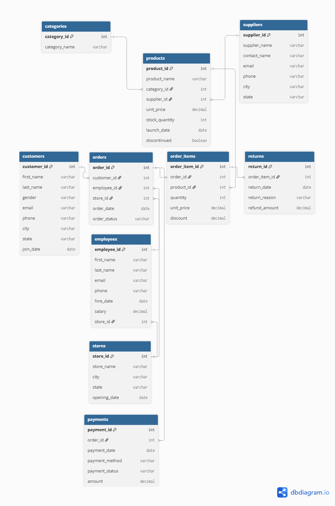
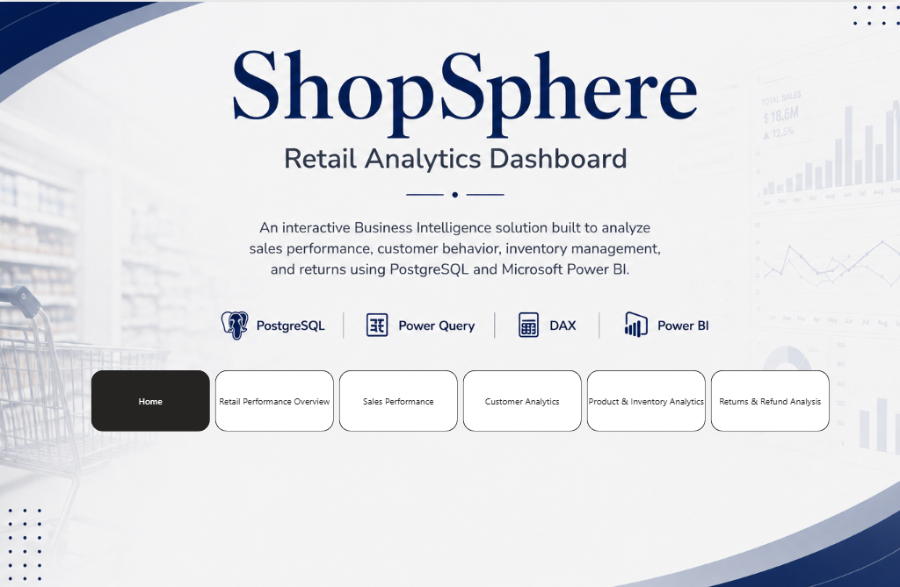
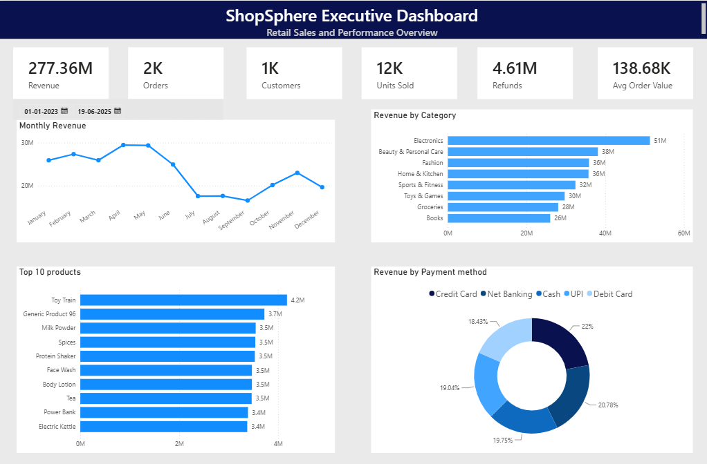
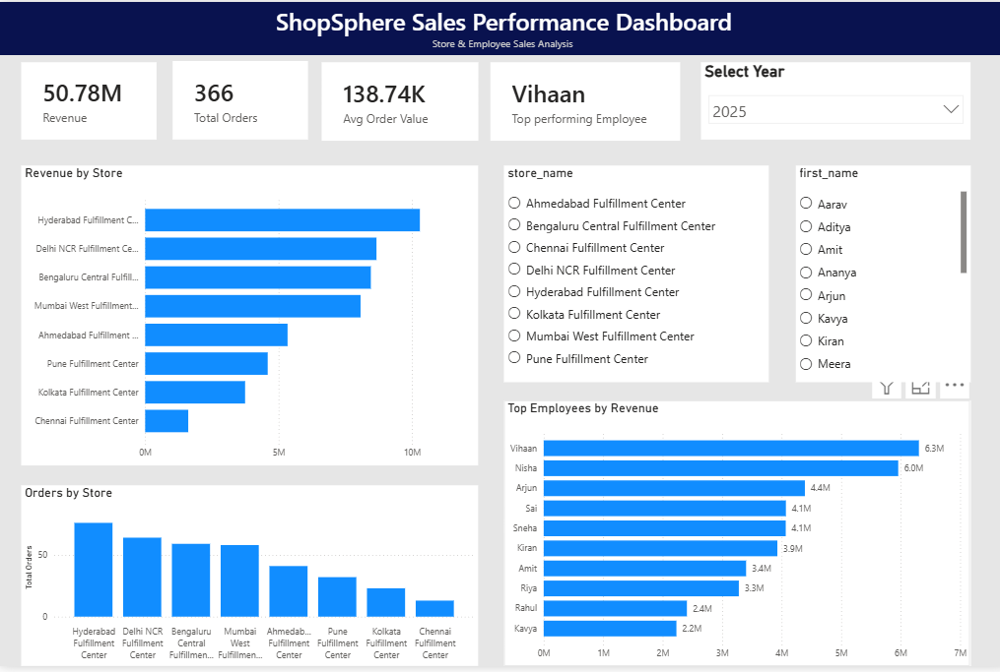
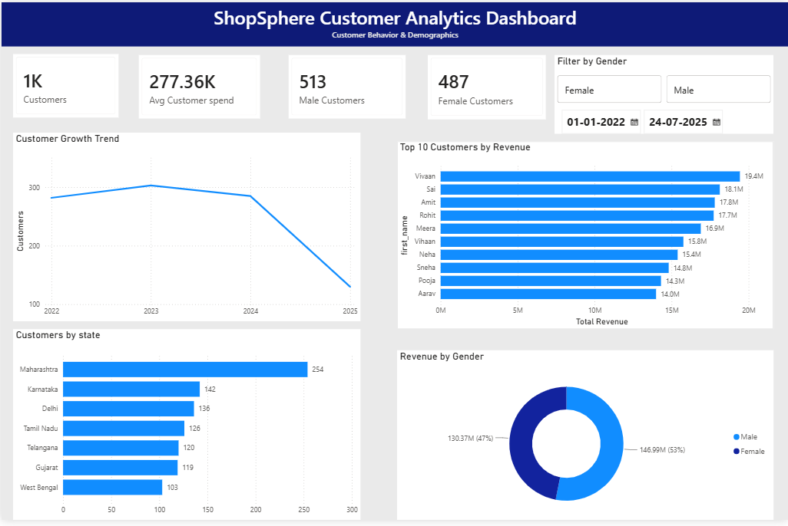

# ShopSphere Retail Sales Analytics using PostgreSQL & Power BI

## Project Overview

This project demonstrates an end-to-end Retail Analytics solution built using PostgreSQL and Microsoft Power BI. Starting from a normalized relational database, advanced SQL queries were used to solve real-world business problems, followed by interactive Power BI dashboards to visualize KPIs, trends, customer behavior, product performance, inventory insights, and returns analysis.  

## Business Problem

ShopSphere is a retail company that collects transactional data from customers, orders, products, payments, employees, suppliers, and returns.
Although large volumes of data are generated daily, the business lacks a centralized analytical process to answer important operational and strategic questions.

As a Data Analyst, the objective of this project is to transform raw retail transaction data into actionable business insights by designing a relational database in PostgreSQL, performing advanced SQL analysis, and developing interactive Power BI dashboards for business decision-making.

## Project Objectives

The analysis aims to:
- Monitor overall business performance through executive KPIs.
- Identify top-performing products and categories.
- Analyze customer purchasing behavior and lifetime value.
- Evaluate employee sales performance.
- Track monthly sales trends and revenue growth.
- Identify products contributing most to revenue.
- Segment customers for targeted marketing using RFM analysis.

## Project Workflow

```text
CSV Dataset
      │
      ▼
PostgreSQL Database
      │
      ▼
SQL Business Analysis
      │
      ▼
Power BI Data Modeling
      │
      ▼
DAX Measures
      │
      ▼
Interactive Dashboards
      │
      ▼
Business Insights
```

## Database Overview

The project is built on a normalized relational database consisting of **10 interconnected tables** that simulate a real-world retail sales environment.

| Table | Description |
|--------|-------------|
| Customers | Customer information and demographics |
| Orders | Customer order records |
| Order_Items | Products included in each order |
| Products | Product catalog |
| Categories | Product categories |
| Employees | Employees responsible for processing orders |
| Suppliers | Supplier information |
| Payments | Payment details for orders |
| Returns | Returned products |
| Stores | Store information |

The tables are connected using **Primary Keys** and **Foreign Keys** to maintain referential integrity and accurately represent business relationships.

---
## Entity Relationship Diagram



---
## Technologies Used

### Database & Querying
- PostgreSQL
- SQL
- pgAdmin 4

### Business Intelligence
- Microsoft Power BI
- Power Query
- DAX
- Data Modeling

### Version Control
- Git
- GitHub
---

## SQL Concepts Demonstrated

This project demonstrates practical usage of SQL for business analytics, including:

- Data Retrieval
- Filtering and Sorting
- Aggregate Functions
- GROUP BY and HAVING
- Joins
- Subqueries
- Common Table Expressions (CTEs)
- CASE Expressions
- COALESCE
- Date Functions
- Window Functions
- Ranking Functions
- Running Totals
- Rolling Averages
- LAG() and LEAD()
- FIRST_VALUE() and LAST_VALUE()
- Pareto (80/20) Analysis
- RFM Customer Segmentation

---
## Power BI Dashboard

The SQL analysis was transformed into an interactive Business Intelligence solution using Microsoft Power BI.

## Dashboard Preview

### 🏠 Home



### 📊 Retail Performance Overview



### 📈 Sales Performance



### 👥 Customer Analytics



### 📦 Product & Inventory Analytics


### 🔄 Returns & Refund Analysis


## DAX Measures

Developed dynamic DAX measures for:
- Total Revenue
- Total Orders
- Total Customers
- Average Order Value
- Refund Amount
- Average Customer Spend
- Return Rate
- Best Performing Employee
- Low Stock Products
---

## Analytical Solutions

The project focuses on solving real business problems across multiple business domains.

### Executive Performance

- Monitored overall business performance using executive KPIs.
- Measured revenue, customer base, order volume, and returned items.

### Sales Analysis

- Analyzed revenue across different states.
- Identified monthly sales trends.
- Calculated cumulative revenue and month-over-month growth.

### Product Analysis

- Identified top-selling products.
- Evaluated category performance.
- Ranked the best-performing products within each category.
- Determined which products contribute to 80% of total revenue using Pareto analysis.

### Customer Analytics

- Identified high-value customers.
- Calculated Customer Lifetime Value (CLV).
- Ranked customers based on revenue contribution.
- Analyzed customer purchasing intervals and retention.
- Segmented customers using RFM analysis for targeted marketing strategies.

### Employee Performance

- Evaluated employee contribution based on revenue generated and orders handled.

---

## Business Value Delivered

The analysis provides actionable insights that can help business stakeholders:

- Monitor business performance through executive KPIs.
- Identify high-performing products and categories.
- Recognize the company's most valuable customers.
- Improve customer retention through behavioral analysis.
- Optimize marketing campaigns using RFM segmentation.
- Focus inventory planning on products driving the majority of revenue.
- Monitor sales growth and identify seasonal trends.
- Support strategic business decisions using data-driven insights.
- Enabled interactive dashboard exploration using filters, slicers, and page navigation.

---

## Repository Structure

```
ShopSphere-End-to-End-Retail-Analytics/

│── Database/
│
│── Business Analysis/
│
│── Power BI/
│      ShopSphere_Retail_Analytics_Dashboard.pbix
│
│── Dashboard Screenshots/
│      Home.png
│      Retail Performance Overview.png
│      Sales Performance.png
│      Customer Analytics.png
│      Product & Inventory.png
│      Returns & Refund Analysis.png
│
│── Images/
│
│── README.md
```


## Author

**Shreya K**
